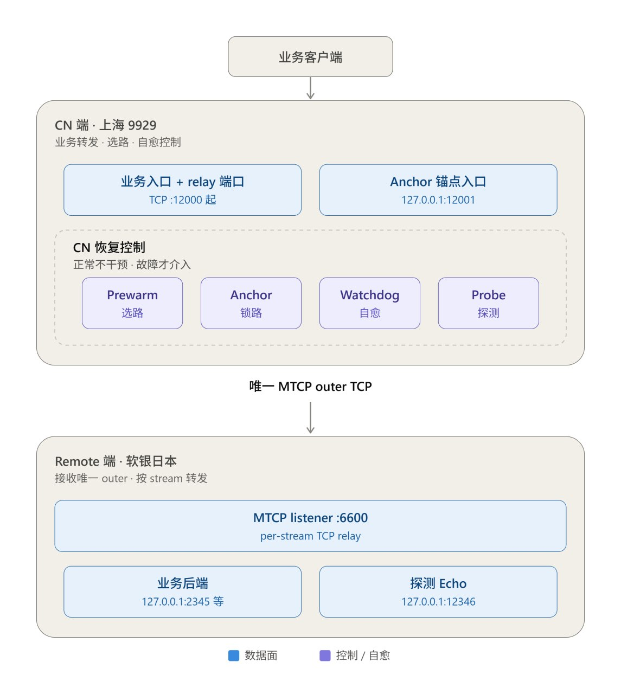

<h1 align="center">9929-gost-mtcp</h1>

<p align="center">
  <strong>上海 9929 → 软银日本线路的 TCP ECMP 快路优选与故障自愈</strong>
</p>

<p align="center">
  
  
</p>

---

上海 9929 宽带到部分软银日本线路存在明显的 TCP per-flow ECMP: 同一个目的地址, 不同 TCP 连接可能被哈希到不同物理路径, 实测大致是快路 ~33ms、慢路 ~50-52ms。普通 TCP 代理每建一条新连接都要重新参与一次 ECMP 哈希, 所以延迟会在快慢路径之间随机跳。

这个项目的目标不是让线路本身变快, 而是:

> 先抽到一条低延迟的 TCP 路径, 再用 GOST MTCP 把后续业务长期复用在这一条 outer TCP 上, 让它们不用再重新参与 ECMP。

早期想法是抽到慢路就用 `ss -K` 踢掉重连, 但这个思路不适合长期跑: `ss -K` 杀的是整条 MTCP outer, 上面挂着的所有业务 logical stream 会跟着一起断流; 而且重连依然要重新过一次 ECMP, 不保证能抽到快路, 容易陷入反复 kill/reconnect。所以最终改成了**只在启动或真正故障时重新选路, 正常运行期间不去碰已经选好的 outer**。方案演进的完整过程(为什么用 `minrtt` 而不是实时 `rtt`、Anchor 中间踩过的坑等)记在 `DESIGN-archive.md` 里。

已经实测覆盖三种故障场景并能自动恢复: Remote 整体不可达、outer 消失、TCP 还显示 `ESTAB` 但 MTCP 数据面其实已经失效。

## 怎么工作的

系统由四部分组成:

- **Prewarm** 负责选路。启动或故障恢复时建一条候选 outer, 读 TCP 的 `minrtt`(不是实时 rtt——后者容易被排队、重传、突发流量干扰, `minrtt` 才能反映这条连接真正走的是哪条基础路径), 够快就留下, 不够快就废弃重抽, 直到抽中快路(或者额度用完, 先保证业务能连上)。
- **Anchor** 负责锁路。它在选中的路径上维持一个很轻的 logical stream, 不承载业务, 唯一作用是防止这条 outer 因为暂时没有业务流量被 GOST 回收。
- **Data-plane Probe** 负责验证"这条 outer 是不是真的能用"。`ESTAB` 只说明 socket 还在, 不代表数据面真通; 探测靠一次真实的 payload 收发来确认。
- **Watchdog** 是最终的控制器。正常状态下它什么都不干, 只有真正探测到故障(GOST crash、outer 消失、outer 变成假活、Remote 整体不可达等)时才出手清理、重建、重新选路。

另外几条原则: 运行中的实时 RTT 只用来告警, 不会因为一次瞬时拥塞就把正在用的连接踢掉; Remote 整体联系不上时安静等待, 不会疯狂重启 GOST 或反复重抽; 任何时候都只保留一条 MTCP outer TCP, 所有业务共享它。

一句话总结整个设计:

> 启动时积极选路, 正常时绝不折腾, 故障时彻底重建。

它不是一个持续切换线路的负载均衡器, 而是针对 TCP ECMP 场景的**长期路径锁定 + 自动自愈系统**。

## 架构



```text
+----------------+           +------------------------------------+    selected MTCP outer    +--------------------------------+
| Business       |    TCP    | CN GOST                            | ========================> | Remote GOST                    |
| clients        | --------> | business :12000 + relays           |                           | MTCP listener :6600            |
|                |           | anchor/probe 127.0.0.1:12001       |                           | per-stream TCP relay           |
|                |           | shared chain-mtcp / connector      |                           |                                |
+----------------+           +------------------+-----------------+                           +----------------+---------------+
                                                ^                                                              |
                                                | manages / observes                                           v
                             +------------------------------------+                           +--------------------------------+
                             | CN recovery control                |                           | requested stream targets       |
                             | Prewarm : draw ECMP by minrtt      |                           | business :2345/:2347/...       |
                             | Anchor  : hold logical stream      |                           | probe echo :12346              |
                             | Watchdog: PID/outer/RTT/Remote     |
                             | Probe   : 1-byte payload echo      |
                             +------------------------------------+
```

业务入口(`:12000` 及后续新增的 relay 端口)统一走 `chain-mtcp`, 共享同一个 MTCP connector 和唯一的 outer, 每个 logical stream 各自带自己的 Remote 目标。Anchor 本机入口是 `127.0.0.1:12001`, 打到 Remote 的 echo endpoint `127.0.0.1:12346`。Data Plane Probe 走的是同一条链路(`12001 → chain-mtcp → 选中的 outer → 12346`), 默认每 15 秒发一个 1 字节 payload 来回验证数据面是否真的通。Remote 侧在 `:6600` 收 outer 里的 logical stream, 再按各自目标转发到 `127.0.0.1:2345`、`:2347` 等业务后端或探测 endpoint。

## 快速安装

**推荐: 单文件安装器(不用克隆项目)**

```bash
# 1. 先装 Remote(境外服务器)
curl -fsSL https://raw.githubusercontent.com/zcp1997/9929-gost-mtcp/main/standalone-install.sh | bash -s remote

# 2. 记下 Remote 的公网 IPv4 和 MTCP 端口(默认 6600)

# 3. 再装 CN(中国大陆服务器)
curl -fsSL https://ghfast.top/raw.githubusercontent.com/zcp1997/9929-gost-mtcp/main/standalone-install.sh | bash -s cn
# 按提示输入 Remote IP、端口和 RTT 阈值(默认 40ms)
```

管道安装会从当前终端读取交互输入, 所以直接在 SSH/终端里跑, 别把 stdin 重定向掉。`GOST_VERSION=v3.2.6` 里的 `v` 只是 Release tag 用的, 安装器会自动去掉它找对应的资产文件名。

**传统方式(开发/调试用, 能看到完整代码)**

```bash
# CN 服务器
git clone https://ghfast.top/https://github.com/zcp1997/9929-gost-mtcp.git
cd 9929-gost-mtcp
bash install.sh cn

# Remote 服务器
git clone https://github.com/zcp1997/9929-gost-mtcp.git
cd 9929-gost-mtcp
bash install.sh remote
```

## 系统要求

| 组件 | 要求 |
|------|------|
| **OS** | Linux + systemd |
| **权限** | root |
| **通用依赖** | bash, curl, tar, awk, grep, systemctl, sha256sum/shasum |
| **CN 额外** | ss (iproute2), flock (util-linux), timeout (coreutils) |
| **Remote 额外** | socat |

Debian/Ubuntu 装依赖:

```bash
# 通用
apt-get install -y curl tar coreutils grep gawk systemd

# CN 端
apt-get install -y iproute2 util-linux

# Remote 端
apt-get install -y socat
```

## 安装后验证

**Remote:**

```bash
systemctl status gost-mtcp-remote.service
ss -lntp | grep ':6600'
```

**CN(假设线路别名是 jp):**

```bash
systemctl status gost-mtcp-jp.service
systemctl status gost-mtcp-jp-watchdog.service

# 查看状态
cat /opt/gost-mtcp/cn/instances/jp/state/status.json

# 查看事件日志
tail -f /opt/gost-mtcp/cn/instances/jp/state/events.jsonl

# 查看 outer 连接(替换实际 IP 和端口)
ss -tin state established 'dst <REMOTE_IP> dport = :6600'
```

正常状态长这样: `state: FAST`、`outer_count: 1`(唯一一条 outer)、`minrtt_ms < 40`(快路)、`data_plane_reachable: yes`(数据面真的通)、`data_probe_failures: 0`、`data_probe_breaker: closed`、`process_breaker: closed`、`anchor_state: up`。

## 常见配置

**修改 CN 后端地址** —— CN 的 `forwarder.nodes[0].addr` 就是 Remote 最终要连的那个 TCP 目标:

```bash
# 单文件安装器默认路径
nano /opt/gost-mtcp/cn/instances/jp/cn.yaml

# 或传统方式路径
nano /root/9929-gost-mtcp/cn/cn.yaml

# 修改后端地址
forwarder:
  nodes:
  - name: backend
    addr: 127.0.0.1:8080  # 改成实际地址

# 重启服务
systemctl restart gost-mtcp-jp.service
```

**修改 RTT 阈值:**

```bash
nano /opt/gost-mtcp/cn/instances/jp/mtcp.conf

# 修改阈值
ACCEPT_RTT_MS=35

# 重启 Watchdog
systemctl restart gost-mtcp-jp-watchdog.service
```

### 数据面探测与 stale outer 恢复

Watchdog 默认每 15 秒经本地 Anchor 入口收发 1 字节验证数据面。连续失败 3 次后, 会额外单独建一条 TCP 去探测 Remote 的 MTCP 端口:

- Remote TCP 不可达 → 判定整条链路真断了, 安静等待, 不循环重启 GOST 也不循环重抽
- Remote TCP 可达 → 判定当前 outer 是 stale 的(连接还在但数据面死了), 限频重启 GOST, 交给 Prewarm 重新选路

```bash
# mtcp.conf 默认值
DATA_PROBE_ENABLED=yes
DATA_PROBE_INTERVAL_SEC=15
DATA_PROBE_TIMEOUT_SEC=3
DATA_PROBE_FAIL_THRESHOLD=3
DATA_PROBE_RESTART_WINDOW_SEC=600
DATA_PROBE_RESTART_MAX=3
DATA_PROBE_BREAKER_OPEN_SEC=600
```

把 `DATA_PROBE_ENABLED` 改成 `no` 可以退回旧版行为, 只看 outer 的 TCP 状态。如果探测 endpoint 配错了或者一直失败, 10 分钟内因 stale outer 重启满 3 次就会进 `FAULT/DATA_PROBE_BREAKER`, 停 10 分钟不再重启; 之后只放一次 half-open 试探, 数据面探测成功了才会关闭熔断。

GOST 触发 systemd 的 `StartLimit` 后, Watchdog 会低频做 `reset-failed + restart`, 默认 10 分钟最多 3 次, 再多就进 `FAULT/PROCESS_BREAKER`。进程连续健康 60 秒后熔断器自动关闭。

### 故障恢复路径(均已实测)

**Remote 整体不可达**(在 Remote 端用 nftables `DROP` 掉 MTCP 端口验证过):

```
OUTER_DISAPPEARED → REMOTE_TCP_DOWN → DOWN/REMOTE(安静等待)
  → [解除 DROP] → REMOTE_TCP_UP → RECOVERY_SELECT
  → PREWARM_SUCCESS(约 33.5ms) → ANCHOR_BOUND → FAST
```

期间不会循环重启 GOST、循环 Prewarm 或高频刷恢复日志; 解除封禁后能自动重新选路, 恢复到约 33.5ms 的 `FAST` 状态。

**TCP 显示 ESTAB, 但 MTCP 数据面已经死了**(只丢弃当前 outer 的四元组, 同时保留 Remote 新连接的可达性来验证):

```
outer_count=1; TCP=ESTAB; payload=FAIL → DATA_PROBE_FAILED 1/3 → 2/3 → 3/3
  → STALE_OUTER_CONFIRMED(remote_tcp=up) → RESTART_GOST → PID_CHANGED
  → PREWARM_SUCCESS(33.319ms) → ANCHOR_BOUND
  → FAST(data_plane_reachable=yes, failures=0)
```

实测过一次: 旧 PID `40229`、outer sport `21764` 在内核里还显示 `ESTAB`, 但连续探测失败; Watchdog 确认是 stale outer 后自动重启 GOST, 新 PID `46156` 建立 sport `24570`, 以 `minrtt=33.319ms` 恢复到 `FAST`。

这两条路径合起来覆盖了 Remote 真断、outer 消失、outer 还在但数据面已死三种情况。要注意的是: hard failure 发生时已有的业务 TCP 连接没法无缝迁移, 恢复目标是让**后续新连接**尽快可用, 不是保住老连接。

### 多线路部署

同一台 CN 可以接多个 Remote, 每次执行 `standalone-install.sh cn` 时输入不同的线路别名就行:

```bash
# 第一条线路
bash standalone-install.sh cn
# 别名: jp, 业务端口: 12000, Anchor: 12001

# 第二条线路
bash standalone-install.sh cn
# 别名: us, 业务端口: 12002, Anchor: 12003
```

每条线路有自己独立的配置和状态, 只共享 GOST 二进制和运行脚本:

```text
/opt/gost-mtcp/cn/
├── gost, mtcp-lib.sh, mtcp-prewarm.sh, mtcp-watchdog.sh
└── instances/
    ├── jp/  -> cn.yaml, mtcp.conf, state/
    └── us/  -> cn.yaml, mtcp.conf, state/
```

安装器不会覆盖正在跑的线路, 避免 GOST 和 Watchdog 读到新旧不一致的配置。重装前先停掉提示里列出的 main、Anchor、Watchdog 三个 unit; Remote 重装也是同样的保护逻辑。

### 管理 CN 额外端口 Relay

不用手改 YAML, standalone 安装器自带列出/新增/删除业务入口的功能。新增的 Relay 会和主入口共用同一个 `chain-mtcp` 和唯一的 MTCP outer:

```bash
# 交互式管理
bash standalone-install.sh relay

# 或者分项命令
bash standalone-install.sh relay list
bash standalone-install.sh relay add
bash standalone-install.sh relay remove relay-12002
```

比如 `relay add` 后输入:

```text
新增 CN 监听端口: 12002
Remote 后端地址: 127.0.0.1:2347
Relay 服务名: relay-12002
```

就会生成 `:12002 → chain-mtcp → 127.0.0.1:2347`, 同时把 `12002` 写进 `BUSINESS_PORTS`。`cn.yaml` 和 `mtcp.conf` 是一起备份、一起替换的, GOST 没能正常恢复的话两者一起回滚。Watchdog 用一次 `ss` 快照统计所有业务端口的连接数, 慢路重抽前 Prewarm 还会再确认一遍业务是不是真空闲。主业务端口和 Anchor 端口不能删除或覆盖。

如果安装目录不是默认的 `/opt/gost-mtcp`, 管理时带上同样的环境变量:

```bash
INSTALL_BASE=/root/mtcpjpv22 bash standalone-install.sh relay
```

只有一条线路时安装器会自动识别; 多条线路并存时必须指定目标:

```bash
CN_INSTANCE=jp bash standalone-install.sh relay
```

旧版 `$INSTALL_BASE/cn/cn.yaml` 平铺布局仍然兼容, 也可以用 `CN_YAML_PATH`、`CN_MTCP_CONFIG_PATH` 显式指定两个文件路径。

## 重要注意事项

⚠️ **Remote 防火墙必须配好** —— MTCP Relay 没有应用层认证, 千万不要对全网开放。防火墙里只放行 CN 的公网 IP 访问 MTCP 端口:

```bash
# UFW 示例
ufw allow from <CN_IP> to any port 6600 proto tcp
```

⚠️ **别手动 enable CN 的 Anchor unit** —— Anchor 必须由 Prewarm/Watchdog 控制, 不要自己启动或 enable 它:

```bash
# ❌ 错误
systemctl enable gost-mtcp-jp-anchor.service

# ✓ 正确(安装器已经自动配置好了)
systemctl enable gost-mtcp-jp.service
systemctl enable gost-mtcp-jp-watchdog.service
```

⚠️ **hard failure 没法无缝续传** —— 如果 outer TCP 真断了、GOST 被 kill, 或者 Remote 失联, 已有的业务 TCP 连接没法迁移到新 outer, 得等客户端自己重连。Watchdog 保证的是让新连接尽快恢复, 不是保住老连接。

单文件安装器适合生产部署或批量安装(下载快、不用装 Git、一行命令); 想边看代码边调试、了解完整设计的话用传统方式(`git clone` 后跑 `install.sh`)。

## 状态说明

| 状态 | 含义 |
|------|------|
| `FAST` | 唯一 outer、Anchor 正常、路径满足阈值 |
| `DEGRADED` | 连接可用但没达到最佳(路径慢、Anchor 异常、数据面探测暂时失败等) |
| `DOWN` | GOST/outer/Remote 不可用 |
| `FAULT` | outer 数量异常、stale outer, 或者优选过程本身出故障 |

## 故障排查

```bash
# 查看服务日志
journalctl -u gost-mtcp-jp.service -n 100
journalctl -u gost-mtcp-jp-watchdog.service -n 100

# 查看状态
cat /opt/gost-mtcp/cn/state/status.json | jq

# 查看事件历史
tail -n 50 /opt/gost-mtcp/cn/state/events.jsonl

# 检查 Remote 连通性
timeout 2 bash -c "exec 3<>/dev/tcp/<REMOTE_IP>/6600" && echo "OK" || echo "FAIL"

# 检查当前 MTCP 数据面(替换实际 Anchor 端口)
timeout 3 bash -c '
exec 3<>/dev/tcp/127.0.0.1/12001 || exit 1
printf P >&3
IFS= read -r -n 1 reply <&3 || exit 1
[[ "$reply" == P ]]
' && echo "MTCP DATA OK" || echo "MTCP DATA FAIL"
```

## 目录结构

```
9929-gost-mtcp/
├── standalone-install.sh      # 单文件自包含安装器
├── install.sh                  # 传统安装器(需要完整项目)
├── scripts/
│   └── generate-standalone.sh # 从 canonical 文件生成 standalone 嵌入区
├── tests/
│   └── run.sh                 # shell 语法、生成一致性和关键保护回归检查
├── cn/                         # CN 端配置和脚本
│   ├── cn.yaml
│   ├── mtcp.conf
│   ├── mtcp-lib.sh
│   ├── mtcp-prewarm.sh
│   ├── mtcp-watchdog.sh
│   └── *.service
└── remote/                     # Remote 端配置
    ├── remote.yaml
    └── *.service
```

`cn/` 和 `remote/` 是运行配置、脚本和 systemd 的唯一来源。改了这些 canonical 文件之后记得跑一下 `scripts/generate-standalone.sh`; CI 或本地想确认 standalone 有没有跟着漂移, 用 `scripts/generate-standalone.sh --check`。

更详细的设计背景和原始方案讨论见 `DESIGN-archive.md`。

## 许可证

MIT
